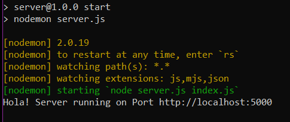
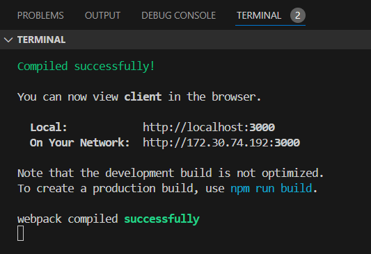
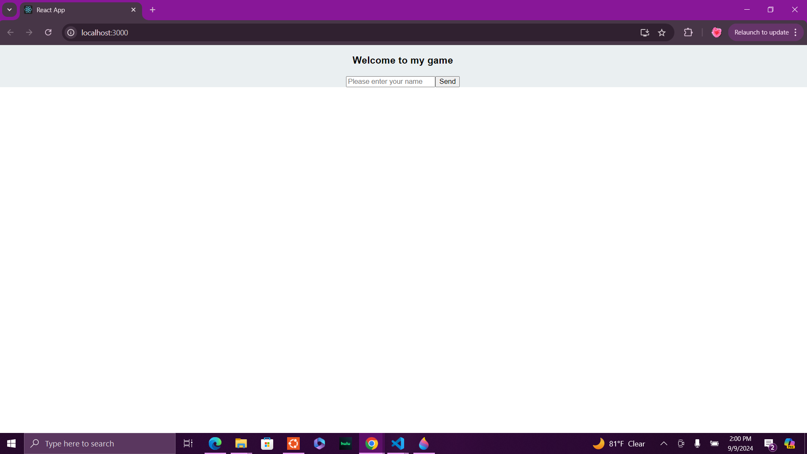
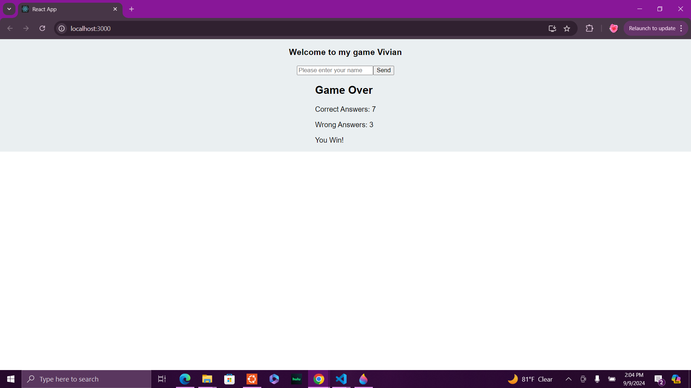

# How to start the app:
1. In your terminal, navigate to the server folder and run the command `npm start`, you should receive this message:

2. Navigate to the client folder in a seperate terminal and run the command `npm start` there as well, response should look like this:

3. Open the link to localhost:3000, window should look like this:

4. Enter name and click send, answer questions by selecting true or false, once finished, game should display final score:

# week8TriviaGame
